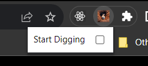
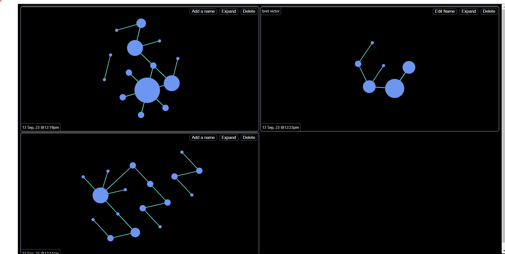
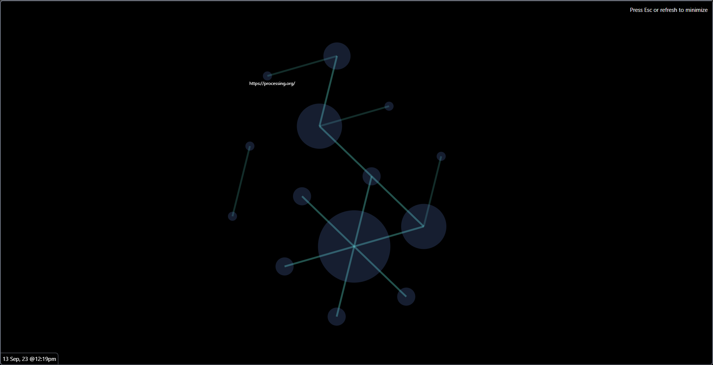

1. Clone this repo using
   `git clone https://github.com/Abhimanyu08/rabbit-hole-extension.git`.
2. Open chrome and type in `chrome://extensions` in the search bar.
3. Make sure you toggle the `Developer mode` option in top-right corner.
4. Click on `Load Unpacked` in the top-left corner.
5. Select the folder you cloned the repo in.
6. The extension is now enabled.
7. Pin the extension to your search bar

### How this extension works

1. Check this little box to permit the extension to track your tabs and history.
   Checking this box starts a "rabbit hole session"

2. Keep browsing as your normally do, diving in rabbit holes and having fun.

Now,

_Every link you click_

_Every site you frolick_

_Every tab you change_

_Every move you make, I'll be watching you_ -
[The Police](https://open.spotify.com/track/0UdMtBHk8eThL3xcuSXQFi?autoplay=true)

This extension will watch for url changes and tab switches. A "rabbit hole
session" ends when you uncheck that little box.

3. At any point in time, you can press `Ctrl-H` or navigate to
   `chrome://history` page. This page will show all your "rabbit hole sessions"
   in a nice graphical view. Mine looks like this rn.

Each grid cells corresponds to one "rabbit hole session".

4. You can name, expand or delete any given session.

5. You can simply use the browser's sweet find feature (by pressing `Ctrl-F`) to
   search through names and links on this page.

6. The nodes and url text open that link in a new tab on click and continue the
   same rabbit hole session.

### Future To-dos:

1. **Kinds of links**:

-   Redirects (solid blue line)
-   Tab switch (dotted line)
-   Go to new tab or press home button and search something (dotted red line or
    no link at all?)

2. **Continue the same session**:

    Right now a session starts and ends when you check and uncheck that little
    box. There's no way to continue a rabbit hole session in the future.

3. **Add info**:

    Give the user ability to
    [add some small note to each node or link between nodes](https://joodaloop.com/small-boxes/).

4. **Share rabbit hole sessions**:

    Share your session through a public url

5. **Steal ideas from
   [Tyler angert](https://tyler.cafe/internet-research-tools)**
