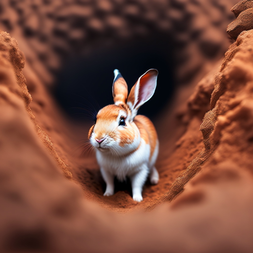

1. Clone this repo using
   `git clone https://github.com/Abhimanyu08/rabbit-hole-extension.git`.
2. Open chrome and type in `chrome://extensions` in the search bar.
3. Make sure you toggle the `Developer mode` option in top-right corner.
4. Click on `Load Unpacked` in the top-left corner.
5. Select the folder you cloned the repo in.
6. The extension is now enabled.
7. Pin the extension to your search bar

### How this extension works

1. Check this little box to permit the extension to track your tabs and history.
   Checking this box starts a "rabbit hole session"

2. Keep browsing as your normally do, diving in rabbit holes and having fun.

> Every breath you take And every move you make Every bond you break Every step
> you take I'll be watching you

Just kidding, this extension will just watch for url changes and tab switches.

3. At any point in time, you can press `Ctrl-H` or navigate to
   `chrome://history` page. This page will show all your "rabbit hole sessions"
   in a nice graphical view.
